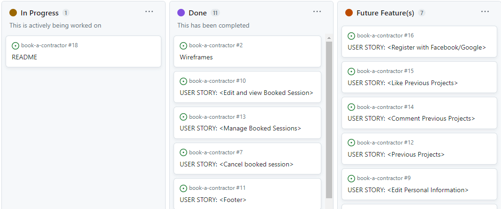
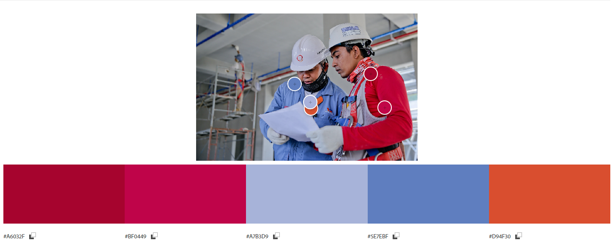
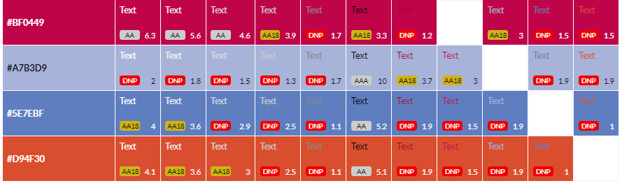
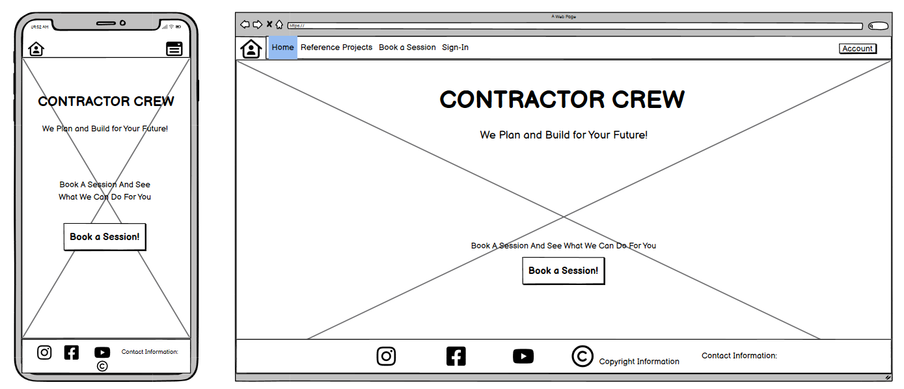
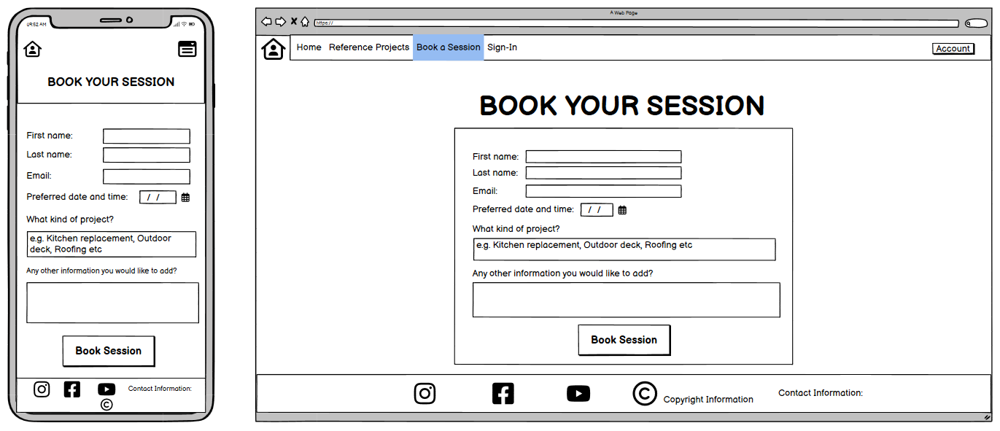
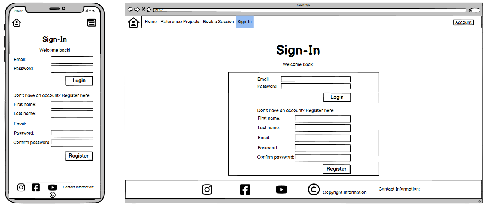
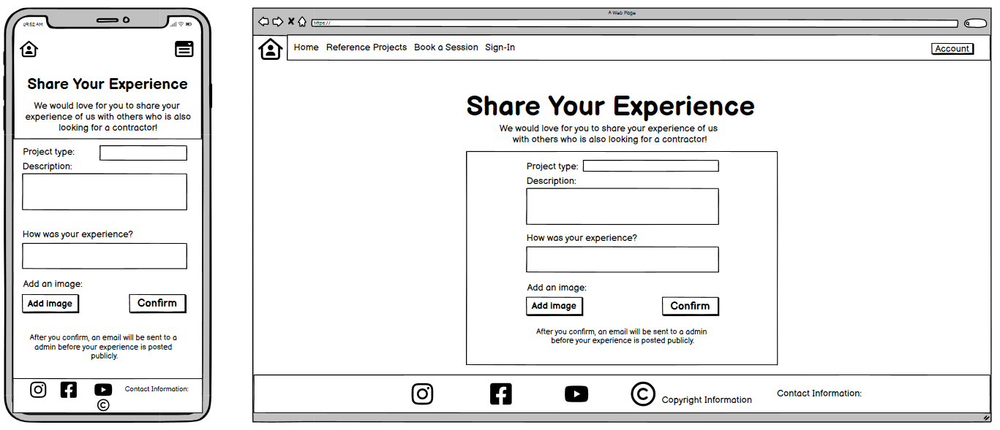
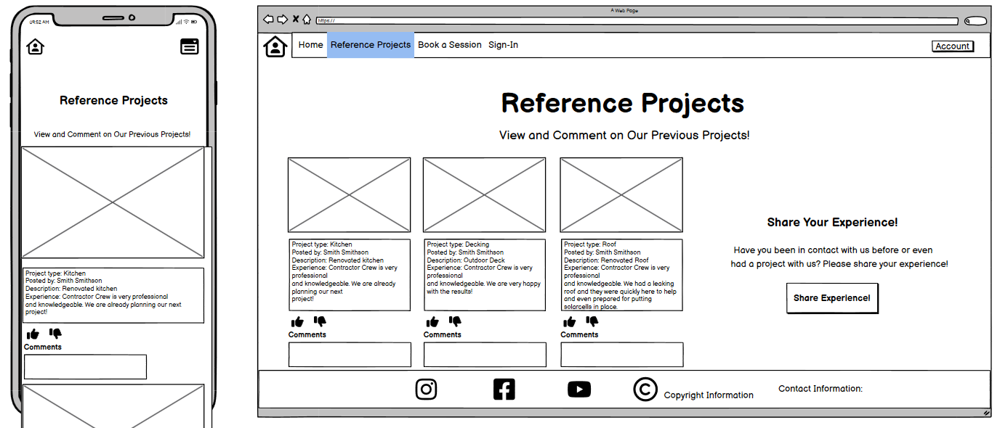

# Book A Contractor

## Introduction
This is a website where anyone can come and book a meeting with a Contractor. They can help you plan many type of projects and they also help you out with the project itself when it comes to building it. What this site then is for is to connect people who want to build something with someone who can make it happen. 

[View the live project here](https://book-a-contractor-e3bf2a381fca.herokuapp.com/)

[Link to Github Repository](https://github.com/BjornRodin/book-a-contractor)

## Table of Content
- [Introduction](#introduction)
- [User Experience (UX)](#user-experience-ux)
    - [Introduction](#introduction-1)
    - [User Stories](#user-stories)
        - [Site User](#site-user)
        - [Site Admin & Owner](#site-admin--owner)
    - [Design](#design)
        - [Graphics](#graphics)
        - [Lucid Chart](#lucid-chart)
        - [Wireframes](#wireframes)
- [Features](#features)
    - [Existing Features](#existing-features)
    - [Future Features](#future-features)
- [Testing](#testing)
    - [User Stories Testing](#user-stories-testing)
       - [As a Site User I can view and edit my booked session(s) so that I can edit any of the information previously provided if needed](#as-a-site-user-i-can-view-and-edit-my-booked-sessions-so-that-i-can-edit-any-of-the-information-previously-provided-if-needed)
       - [As a Site User I can cancel my bookings so that I can delete a previously made booking when logged in](#as-a-site-user-i-can-cancel-my-bookings-so-that-i-can-delete-a-previously-made-booking-when-logged-in)
       - [As a Site User I can quickly find possible social links in the footer so that I can navigate to those links](#as-a-site-user-i-can-quickly-find-possible-social-links-in-the-footer-so-that-i-can-navigate-to-those-links)
       - [As a Site User I can navigate the site easily so that I know where I am and where I can see and do certain things](#as-a-site-user-i-can-navigate-the-site-easily-so-that-i-know-where-i-am-and-where-i-can-see-and-do-certain-things)
       - [As a Site User I can login so that I can book a session and view my current bookings](#as-a-site-user-i-can-login-so-that-i-can-book-a-session-and-view-my-current-bookings)
       - [As a Site User I can register to the site so that I can book a session](#as-a-site-user-i-can-register-to-the-site-so-that-i-can-book-a-session)
       - [As a Site User I can click the button on the home-page so that I can make a booking](#as-a-site-user-i-can-click-the-button-on-the-home-page-so-that-i-can-make-a-booking)
       - [As a Site User I can not book several sessions during the same date so that can't double-book myself if I already have a booking that day](#as-a-site-user-i-can-not-book-several-sessions-during-the-same-date-so-that-cant-double-book-myself-if-i-already-have-a-booking-that-day)
       - [As a Site Admin I can manage booked sessions user's made so that I can manage my bookings](#as-a-site-admin-i-can-manage-booked-sessions-users-made-so-that-i-can-manage-my-bookings)
       - [As a Site Owner I can display relevant content to my profession such as images, text and a clear button for bookings so that site users can clearly see what the site is for](#as-a-site-owner-i-can-display-relevant-content-to-my-profession-such-as-images-text-and-a-clear-button-for-bookings-so-that-site-users-can-clearly-see-what-the-site-is-for)
    - [Automated Testing](#automated-testing)
        - [W3C Markup Validation Service](#w3c-markup-validation-service)
            - [Home Page](#home-page)
            - [Register Page](#register-page)
            - [Login Page](#login-page)
            - [My Bookings Page](#my-bookings-page)
            - [Book a Session Page](#book-a-session-page)
            - [Logout Page](#logout-page)
            - [View Booking Page](#view-booking-page)
            - [Update Booking Page](#update-booking-page)
            - [Delete Booking Page](#delete-booking-page)
        - [W3C CSS Validation Service](#w3c-css-validation-service)
        - [Python Validator](#python-validator)
            - [Project](#project)
                - [settings.py](#settingspy)
                - [urls.py](#urlspy)
                - [settings.py](#settingspy)
            - [Booking Application](#booking-application)
                - [admin.py](#adminpy)
                - [forms.py](#formspy)
                - [models.py](#modelspy)
                - [urls.py](#urlspy-1)
                - [views.py](#viewspy)
        - [Google Lighthouse performance test](#google-lighthouse-performance-test)
    - [Manual Testing](#manual-testing)
        - [Features Test](#features-test)
        - [Responsiveness](#responsiveness)
- [Bugs](#bugs)
- [Technologies](#technologies)
    - [Requirements](#requirements)
- [Deployment](#deployment)
    - [ElephantSQL](#elephantsql)
    - [Gitpod & Github](#gitpod--github)
    - [Deployment to Heroku](#deployment-to-heroku)
    - [Version Control](#version-control)
- [Credits](#credits)
    - [Media](#media)
    - [Code](#code)
    - [Content](#content)
- [Acknowledgements](#acknowledgements)

## User Experience (UX)

### Introduction
The goal for this website is to provide people with an simple and easy way to get in contact with a contractor for basically any kind of building project they might think of. By being able to register to the site the user can then create a booking with a contractor. After that they can also see their booking directly being presented at the page 'My Bookings'. From this view the user can then see for what they have booked a meeting for and also the day and time. This site then makes sure to shorten the 'gap' that might be for any person with a project in mind to actually be able to realize it together with a contractor.

### User Stories
The project was made with agile methods and can be seen in the repository in the [Project Board](https://github.com/users/BjornRodin/projects/7) where also more comments can be found.

Below is a outtake from that page:

#### Site User
- As a Site User I can view and edit my booked session(s) so that I can edit any of the information previously provided if needed.
- As a Site User I can cancel my bookings so that I can delete a previously made booking when logged in.
- As a Site User I can quickly find possible social links in the footer so that I can navigate to those links.
- As a Site User I can navigate the site easily so that I know where I am and where I can see and do certain things.
- As a Site User I can login so that I can book a session and view my current bookings.
- As a Site User I can register to the site so that I can book a session
- As a Site User I can click the button on the home-page so that I can make a booking.
- As a Site User I can not book several sessions during the same date so that can't double-book myself if I already have a booking that day.

#### Site Admin & Owner
- As a Site Admin I can manage booked sessions user's made so that I can manage my bookings.
- As a Site Owner I can display relevant content to my profession such as images, text and a clear button for bookings so that site users can clearly see what the site is for.

### Design

#### Graphics
Generally the graphics I was going for was to make it as simple and clear as possible for anyone who visits the website. I did not want it to be cluttered in any way, shape or form. I've worked in the construction field myself and to have simple websites is a key for that industry. So what I went for was a clean landing-page with clear intentions of the site itself. 

- Colors that was chosen for the different elements was extracted from the background image.

    

- These colors was then put into a contrast grid to give an understanding of how the different colors would look against white and black text colors.

    

#### Lucid Chart
[Lucidchart](https://www.lucidchart.com) was used to create the flowchart to better get an idea of how the page is navigated and who can see what and at what stage. By doing this I could better understand where I was going at each stage. A relationship table was also created for the models using the same tool.

#### Wireframes
The wireframes that I made was, once again, really nice to have to not only design the page, but also to be able to do a better decision regarding the scope of the project. In my example I wanted to add alot to the website because it is easy to have "big" ideas. However, when talking it through with my mentor I quickly realized that it might be to to big of a reach to manage to do everything that I had planned within the timelimit that we got. So for example I did not put in the "Reference Projects" that is mentioned in the wireframes because that would mean I have to add much more content and functions to handle it correctly. But that is what this is for, to get a better understanding of our thoughts and then make decisions based on other things, like time constraints, knowledge, what the website "Must have" and what it "Could have". 

Below is the wireframes:

## Features

### Existing Features
- Nav-bar when logged out & when logged in
    
    
    
- Book a session button on home page

    
- Sign up form

    
- Login functionality

    
- When logged in, My Bookings can be viewed and the user can click on update or delete. If there is no bookings then that is shown too.

    
    
- When logged in, Book a Session form can be seen and submitted with relevant information.

    
- When the user click 'Logout' in the navbar the user is presented with a message and button to make sure that's what they want to do.

    
- When viewing a specific booking the user can in the lead text under the header see which project it is and also a card with the information provided by the user from when they previously booked it. They can then choose to update it, delete it or go back.

    
- When the user click 'Update' on one of their bookings they are presented with a form which is filled in with their previous information. If they want to change anything, they can. Then either click save changes or go back.

    

- If 'Delete' is clicked either in My Bookings on when viewing a specific booking the user is sent to a separate page where they are asked if they are sure about it. If they are, they click 'Delete Booking', else they go back.

    

- Whenever a user is submitting a form, login/logout, or delete a booking the user is presented with a modal message to tell the user that it was successful.

    

- If the user is trying to make a new booking or update a booking for a date and time where a booking already exist they are presented with that information so they know what to do. This prevents doublebookings.

    

### Future Features
- Registering to the site using Facebook or Google.
- Have yet another page visible for users no matter if they are logged in or not where the site admin/owner can present previous projects they've been a part of making. This would preferably be with images as the main showcase to inspire more people to build stuff (and by doing that, make these contractors have more business).
    - Then it would also be good to have a commentsection for users aswell as the possibility to like the different projects that are presented. By doing that then it would create more engagement for the user which then also is beneficial to the owners.
- Have the user be able to edit their personal information if needed. Especially if the site admin/owners decide to ask for more information when the user is registering an account.
- Email verification, when the account is made an email could be sent to the user to verify their email. 
- Approve/Confirm bookings by the admin/owner. When a user make a booking the admin/owner could be notified and have to accept the booking before it is actually booked. 
    - The booking that the user has just submitted for could then have a 'pending' status of some sorts and be notified when it is approved/confirmed.

## Testing

### User Stories Testing

#### As a Site User I can view and edit my booked session(s) so that I can edit any of the information previously provided if needed
- When the user is logged in they can view their current bookings aswell as update them accordingly.

    
    
    
    

#### As a Site User I can cancel my bookings so that I can delete a previously made booking when logged in
- Yes they can and they are also asked if they are sure that they want to delete it to avoid missclicks. The 'Delete' button can be seen both in 'My Bookings' and when the specific booking is viewed. See images above for those buttons. Below is what the user is presented with to make sure they want to delete the booking.

    

#### As a Site User I can quickly find possible social links in the footer so that I can navigate to those links
- The footer is always at the bottom of the page and never changes. That means that the user can always expect to find the relevant social media links at the same location.

    

#### As a Site User I can navigate the site easily so that I know where I am and where I can see and do certain things
- The user can navigate either by using the nav-bar or by the various buttons present in the site. They are all descriptive and with 'hover' effects so that it is easy for the user to see where their cursor is and what they can expect from the button itself. The nav-bar only changes its content when the user login to show more pages. 

    
    

#### As a Site User I can login so that I can book a session and view my current bookings
- Yes the user can login with their account to both book and view current bookings they have planned.

    

#### As a Site User I can register to the site so that I can book a session
- Yes the user can register to the website and after doing that they can directly go and book a session if they want to. The mandatory fields are 'Username' and 'Password'. I chose to do it like that because a user can add their information to the booking instead. My thought process was that a user might have a friend who needs help with a project, but they don't feel comfortable talking to a contractor themselves so they as this user to book it for them. 
- I also thought about the future feature mentioned earlier about having a possibility to make an account with facebook or google instead so I don't want to make the user add any more information than necessary.
- This is also something I realized when looking around the web, most sites ask for as little information as possible for the user to write themselves. I believe that has to do with people not wanting to fill in too much information everywhere.

    

#### As a Site User I can click the button on the home-page so that I can make a booking
- When the button on the home-page is clicked as a non-logged in user then they are sent to the login-page. 
- If they don't have an account then they can from that page navigate to register instead.
- Then when the user is logged in and click on the button to book a session the user is presented with a booking form with relevant information to fill in before the booking is made.

    

#### As a Site User I can not book several sessions during the same date so that can't double-book myself if I already have a booking that day
- This was the original way how I thought about doing it. However, after some testing I felt that it would be better to avoid doublebookings completely, no matter who is making the booking.
- So how it works now is that whenever a new booking or an updated booking is submitted the system checks the database if there is a booking that specific date & time that the user is trying to book. If there isn't, then the booking/update is submitted, otherwise the user is presented with a message saying that date & time is fully booked.

    

#### As a Site Admin I can manage booked sessions user's made so that I can manage my bookings
- In the Admin panel the admin can view all the bookings made and also manage them how they want. However, no implementations has been done to automate messages to the user or admin about changes made by either party. So if the admin wants to reschedule something they would first have to contact the user about it. But when they have agreed on a new date or time then the admin can edit it (instead of making the user do it).
- Some filters is also added for the admin to easier find the specific thing they are looking for.

    
    

#### As a Site Owner I can display relevant content to my profession such as images, text and a clear button for bookings so that site users can clearly see what the site is for
- As a core part of this the background is always the same for the user. This is done because it best resembles what this company is actually doing, they are planning some kind of building project.
- At the landing page the name of the company is clearly visible, a short text that both explains what they do but also inspires people to discuss their projects with them.
- The button at the landing page is then what drives the users to actually make an account and then make a booking. Everything is also clearly visible with no 'fuss', everyone understands what to expect from this site after a quick visit.

    

### Automated Testing

#### W3C Markup Validation Service
First I was trying to validate like usual (basically the same way) but I had forgot that the Django template tags could make it weird. However, this is how I did it.

To validate the HTML code in this project and not get errors because of the Django template tags I followed these steps:
1. Navigated to the deployed website in google chrome
2. Navigate to the specific page to test
3. Right-click the page and above "Inspect" there should be a "View Source code" or "View page source"
4. Copy all the code that appears
5. Go to [W3C Markup Validator](https://validator.w3.org/#validate_by_input) and choose "Direct input"
6. Then paste the code and press "Check" to validate code

##### Home Page
- No errors or warnings to show

##### Register Page
- No errors or warnings to show

##### Login Page
- No errors or warnings to show

##### My Bookings Page
- No errors or warnings to show

##### Book a Session Page
- No errors or warnings to show

##### Logout Page
- First I had some errors regarding an endblock tag and 2 divs that was not closed. Issues was solved but here is images of before and after.

##### View Booking Page
- No errors or warnings to show

##### Update Booking Page
- No errors or warnings to show

##### Delete Booking Page
- First I had some errors regarding an endblock tag and 1 div that was not closed. Issues was solved but here is images of before and after.

#### W3C CSS Validation Service
This was done using [Jigsaw](https://jigsaw.w3.org/css-validator/#validate_by_input) and compying all code from css as a direct input.
- No errors was found in the code

#### Python Validator
To check the Python code in this project I used the [CI Python Linter](https://pep8ci.herokuapp.com/)

##### Project

###### settings.py
- The only errors I have is some that I can do nothing about. The code is simply to long on those rows mentioned and I can't change that.
- I've accepted it as it also is code generated by the system, not code that I wrote, so it should not be an issue.

###### urls.py
- The error that was showing was that I had no new line at the end of the file. Error was resolved and both images can be seen below.

##### Booking application

###### admin.py
- The errors that was present was that a comment was too long and that it was needed 2 blank lines before "@admin.register(Booking)"

- Issue was resolved

###### forms.py
- The errors that was present was trailing whitespaces, too long lines & whitespaces.

- Whitespaces was removed and the longer lines was broken up by either adding a break where possible or by combining those and a "\" as a continuation symbol for the code.
- No errors left

###### models.py
- The errors encountered is too few blank lines in the beginning and a line that is too long.

- Extra line added and fixed the line that was too long with a break.

###### urls.py
- The errors encountered is no new line in end of file and 2 lines that is too long.

- New line added and lines are fixed to not be too long.

###### views.py
- The errors are a mix of blank lines not being present and too long lines.

- Added all blank lines needed and also fixed lines that was too long.

#### Google Lighthouse Performance Test
The tests are all made in the same way:
1. In incognito-mode
2. The same configuration is used, showed in below image. Only 'Device' was changed in between the tests.
    
    

- Desktop
    -  Not very much to say more than that the scoring is really good

    
- Mobile
    - Score is slightly lower for mobile devices than on the desktop but still a good score and i'm happy with that.

    

### Manual Testing

#### Feature Test
Tested according to below image and passing everything.

#### Responsiveness
The responsiveness of the website was tested with google chromes devtools and was tested with all devices available there. Below is a few images from different sizes.
I can't find any responsive design issues on any of the pages. The images are, in order: Desktop, Nest Hub, Galaxy S8 and another to show the dropdown meny for navbar on smaller screensizes.

## Bugs
The bugs that I encountered are all mostly visible in the [Project Board](https://github.com/users/BjornRodin/projects/7). I say 'mostly' because not all the minor bugs is reported there but instead reported in a commit message in the repository. It is also the first time i'm working with a project board so I am still getting a hang of how it works. What i've tried to do is to atleast mention the major bugs and discussing them before finding the solution and mentioning those aswell of course. In any case, below is a list of bugs that was encountered and how they was solved.

A learning experience that I will definitely take with me is that using the Project Board is an amazing tool to keep track of the items that are being worked on and any history related to that development. In future projects and when going into the field of working as a programmer I will be spending as much time as possible organizing this page to not only keep my work updated, but also be able in detail to show anyone else what has been done and when it was implemented. 

However, I am very glad that I was able to use it as much as I did because it really helped me to stay focused on the task at hand and I will keep getting better at using it to its fullest potential. 
1. For the User Story "Edit and view Booked Sessions" on the board a bug was that when the user had loads of bookings then the footer and the overlay would overlap the bookings while they continued to fill the window downwards.
    - It was resolved after some testing in the google chrome devtools looking at the different classes that was used. What I realized was that I had set a fixed view height for all pages because most pages has much less content on it. So what happened was that when this space was completely full then the content would outgrow the body.
    - The solution then was to remove this class for this specific page which then solved the issue.
2. When handling login and logout I first started by making my own templates. This made it so that it was impossible to use the allauth.account which was used in the walkthrough.
    - I quickly realized when going through the material again that I had missed to install the required systems for allauth, but when I did then I could get cracking on removing my own html files for these and instead use the templates within account for allauth. 
    - When this was added then it could be connected correctly and working fine.
3. Another bug was regarding the registration (signup) for the website. As I had decided to not make the email-field mandatory I must have missed trying to register with an email. Because when I started manually testing all the features of the site then I would encounter a "Connection Refused Error".
    - Error message in full: ConnectionRefusedError at /accounts/signup/ [Errno 111] Connection refused
    - As the code had passed through all other tests aswell as validation I was really struggling to understand what was wrong as everything up to now was working.
    - However, after alot of trial and error like looking at how everything was connected with their urls, if the databases was working, if I had accidentally changed anything while cleaning up the code. I could still not resolve the issue. After searching the web I found someone with a similar issue on [Stackoverflow](https://stackoverflow.com/), and it also solved the issue for me. Here is the link to that solution: [Solution](https://stackoverflow.com/questions/57405472/connectionrefusederror-at-accounts-register/62883357#62883357?newreg=3ae225976a1e42d68314973e74f75041)
    - The code that solved the issue is the following and it was added to the settings.py file.
        - EMAIL_BACKEND = 'django.core.mail.backends.console.EmailBackend'
        - ACCOUNT_EMAIL_VERIFICATION = "none"
4. When booking a session I had the crispy form due to a "TemplateDoesNotExist" error where it couldn't find the "uni_form.html" file.
    - I tried to solve it by looking around the web and testing different suggestions but I never got it to work correctly. I also tried to reinstall crispy forms, tested different versions but without luck. 
    - After much searching I found this post on [Stackoverflow](https://stackoverflow.com/questions/75495403/django-returns-templatedoesnotexist-when-using-crispy-forms) where the solution was to install [crispy-bootstrap4](https://pypi.org/project/crispy-bootstrap4/). Since I had already tried this it first didn't work, but then I realized that in a previous attempt to solve the issue I had set "APP_DIRS" to False, but it needed to be True. When that was changed then it worked as intended.
5. Should maybe not call this one a bug, but somewhat it is so I will consider it a bug. At first when creating the datefield in the booking form it was to be manually set by the user. As we want data to be uniform this was a bit of an issue I realized. So instead of that I wanted to look into a datepicker instead, because in such a picker the date will always be uniform and the user will find it easy to choose a date without even having to know how we "want" the data to be presented.
    - To create the datepicker I did read up on django-bootstrap-datepicker-plus and by doing so I could create my endproduct. Where I got the idea from was from [here](https://pypi.org/project/django-bootstrap-datepicker-plus/).
6. When changing content in the models.py and wanted to migrate the changes I got the following information printed to the terminal. "1. Provide a one-off default now (will be set on all existing rows with a null value for this column) OR 2. Quit, and let me add a default in models.py"
    - At first I was confused but when I read this text over and over again I understood that existing rows in the database need some kind of information to put in them when these migrations was to be made.
    With that sorted I could then add default values to the fields that I was either changeing or adding. When that was done the migrations worked fine.

## Technologies
- [Code Institute Template](https://github.com/Code-Institute-Org/gitpod-full-template) was used during this project.
- [GitHub](https://github.com/) is the host which is used to store the code.
- [Git](https://git-scm.com/) was used to commit and push the code to the GitHub repository and works as a version control software. 
- [Lucidchart](https://www.lucidchart.com) was used to create the flowchart and diagram.
- [Google Chrome Lighthouse](https://developers.google.com/web/tools/lighthouse) was used when testing the site.
- [CI Python Linter](https://pep8ci.herokuapp.com/#) was used to validate the Python-code.
- [Heroku](www.heroku.com) project is deployed to Heroku to make it into an app that is accessible through a browser.
- [HTML](https://en.wikipedia.org/wiki/HTML) was used as the for the project.
- [CSS](https://en.wikipedia.org/wiki/CSS) was used to make custom style the HTML elements.
- [Balsamiq](https://balsamiq.com/) was used to create the wireframes.
- [Google Fonts](https://fonts.google.com/) was used to import the fonts that was used.
- [Google Chrome Developer Tools](https://developer.chrome.com/docs/devtools/overview/) was used during the whole project, especially while debugging and making it responsive for different screen-sizes.
- [W3C HTML Validator](https://validator.w3.org/) was used to check for errors in the HTML code in the end of the project.
- [W3C CSS Validator](https://jigsaw.w3.org/css-validator/) was used to check for errors in the CSS code in the end of the project.
- [Pexels](https://www.pexels.com/sv-se/) was used to find the background image for the site.
- [Adobe Color](https://color.adobe.com/sv/create/image) was used to extract colors from the background image.
- [Contrast Grid](https://contrast-grid.eightshapes.com/) Was used to see how the different color would contrast against black and white texts.
- [Fontawesome](https://fontawesome.com/start) to get icons for the project.
- [Favicons](https://favicon.io/) was used to add a favicon to the browser.
- [Cloudinary](https://cloudinary.com/) used to store files for the project.
- [Bootstrap](https://getbootstrap.com/docs/5.3/getting-started/introduction/) was used to build the website.
- [ElephantSQL](https://www.elephantsql.com/) provides the project with PostgreSQL databases.
- [Django](https://www.djangoproject.com/) provides a Python web framework.

### Requirements
Full list of all the libraries and packages in the requirement.txt file

- annotated-types==0.5.0
- asgiref==3.7.2
- cloudinary==1.33.0
- crispy-bootstrap4==2022.1
- dj-database-url==2.0.0
- dj3-cloudinary-storage==0.0.6
- Django==3.2.20
- django-allauth==0.54.0
- django-bootstrap-datepicker-plus==5.0.4
- django-bootstrap4==23.2
- django-crispy-forms==2.0
- django-summernote==0.8.20.0
- gunicorn==21.2.0
- oauthlib==3.2.2
- psycopg2==2.9.6
- pydantic==2.1.1
- pydantic_core==2.4.0
- PyJWT==2.8.0
- python3-openid==3.2.0
- requests-oauthlib==1.3.1
- sqlparse==0.4.4
- urllib3==1.26.16

## Deployment 

### ElephantSQL
Create external database for app data
1. Create an account at [ElephantSQL](https://www.elephantsql.com/)
2. Click "Create New Instance"
3. Type a name for for your plan, usually the projectname. 
4. Select "Tiny Turtle (Free)". 
5. Leave tags field empty 
6. Select your region
7. Select a data center near your location from the list
8. Click "Review"
9. Check your details, then click "Create instance"
10. Return to dashboard and click on your database
11. In the URL section, click the icon to copy the database URL

### Gitpod & Github
1. Create repository in Github using the provided [Code Institute template](https://github.com/Code-Institute-Org/gitpod-full-template)
2. Give your repository a name
3. Click "Create Repository"
4. Open with Gitpod
5. In Gitpod, install all the libraries and packages mentioned in "Requirements"
6. Create your requirements.txt file with command "pip3 freeze --local > requirements.txt"
7. Create a "env.py" file in your project
8. Make sure to add it to your ".gitignore" file
9. In "env.py" file, set this code (on separate lines)
    - import os
    - os.environ["DATABASE_URL]="Your ElephantSQL URL here"
    - os-environ["SECRET_KEY]="your secret key here"
10. Save the file
11. In your settings.py file, enter the following code below your "Path" import
    - import os
    - import dj_database_url
    - if os.path.isfile('env.py'):
        import env
12. Further down, find "SECRET_KEY"
    - Change the previous set key to 'SECRET_KEY' 
13. Next, comment out the original DATABASES variable and type this one below
    - DATABASES = {
        'default': dj_database_url.parse(os.environ.get("DATABASE_URL))
    }
14. Save file
15. Now type this command in the terminal
    - python manage.py migrate
16. Push to github with the following commands in the terminal, one by one
    - git add .
    - git commit -m "commit message"
    - git push
### Deployment to Heroku
1. Assuming you have a Heroku account, otherwise you have to create one.
2. In Heroku, click "Create a new app".
    - Give the app a valid name (names are unique).
    - Then choose your region.
    - Lastly click "Create app"
3. In the tabs, click "Settings".
4. Scroll down to "Config Vars", click "Reveal Config Vars".
    - Add a "Config Var".
        - In the field "KEY", type "DATABASE_URL".
        - In the field "VALUE", paste your "postgres" link from ElephantSQL.
        - Then click "Add"
    - Add another "Config Var".
        - In the field "KEY", type "SECRET_KEY".
        - In the field "VALUE", enter your "secret key".
        - Then click "Add"
    - In the field "KEY", type "CLOUDINARY_URL".
        - Get your link from Cloudinary.
        - Paste the copied link in the field "VALUE" in Heroku.
        - Then click "Add"
    - Add another "Config Var".
        - In the field "KEY", type "PORT".
        - In the field "VALUE", type "8000".
        - Then click "Add"
6. Scroll up and from the menu-tab, click "Deploy".
    - In "Deployment method", choose "GitHub" by clicking it.
    - In "Connect to GitHub", click "Connect to GitHub".
    - In "Connect to GitHub" there now is a searchbar, enter your repository name and then click "Search".
    - Your repository should appear, click "Connect" next to it.
7. Scroll down so you can see "Automatic deploys" and "Manual deploy".
    - You can choose either option.

You have now deployed your project to Heroku!

### Version Control
- A repository was made on Github with Code Institutes Template.
- Coding for the site was done on the [Gitpod](https://www.gitpod.io/) platform.
- Code was added to the staging area with the 'git add .' command.
- The changes in the staging area was committed with the 'git commit -m " "' command.
- All committed code was pushed to Github repository with the 'git push' command.

## Credits
### Media
- Thanks [Anamul Rezwan](https://www.pexels.com/sv-se/@rezwan/) for providing me with the [background-image](https://www.pexels.com/sv-se/foto/manniskor-konstruktion-arbetssatt-man-1216589/)

### Code
- The code that was used in the project was mostly learnt via [Code Institute](https://codeinstitute.net/se/) and their Full Stack Software Development course.
- [StackOverflow](https://stackoverflow.com/) was used to search for information, documented in bugs and in the project hub in the repositories.
- [Bootstrap](https://getbootstrap.com/docs/5.3/getting-started/introduction/) was used to build the pages efficiently.

### Content
- The content was designed and written by me.

## Acknowledgements
- Thank you to my family, especially Joakim Rödin, who have supported, pushed and encouraged me during the project.
- Gratitude to my mentor Jack Wachira for the support he has given me.
- The Slack community.