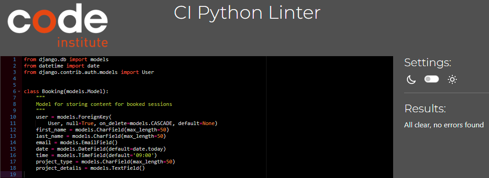
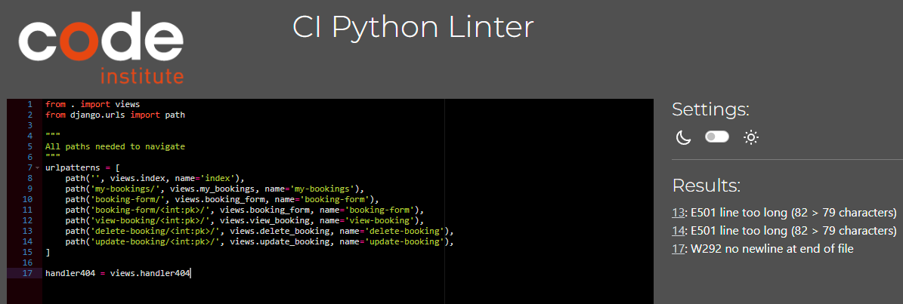

# Book A Contractor

## Introduction
This is a website where anyone can come and book a meeting with a Contractor. They can help you plan many type of projects and they also help you out with the project itself when it comes to building it. What this site then is for is to connect people who want to build something with someone who can make it happen. 

[View the live project here](https://book-a-contractor-e3bf2a381fca.herokuapp.com/)

[Link to Github Repository](https://github.com/BjornRodin/book-a-contractor)

## Table of Content
- [Introduction](#introduction)
- [User Experience (UX)](#user-experience-ux)
    - [User Stories](#user-stories)
        - [Site User](#site-user)
        - [Site Admin/Owner](#site-admin-owner)
    - [Design](#design)
        - [Graphics](#graphics)
        - [Lucid Chart](#lucid-chart)
- [Features](#features)
    - [Existing Features](#existing-features)
    - [Future Features](#future-features)
- [Testing](#testing)
    - [User Stories Testing](#user-stories-testing)
       - [As a first time visitor I want to quickly find and understand the rules](#as-a-first-time-visitor-i-want-to-quickly-find-and-understand-the-rules)
       - [As a first time visitor I want to know how to start the game](#as-a-first-time-visitor-i-want-to-know-how-to-start-the-game)
       - [As a first time visitor I want to get feedback along the way of the game](#as-a-first-time-visitor-i-want-to-get-feedback-along-the-way-of-the-game)
       - [As a returning visitor I want to see the top scores so I can try to beat it](#as-a-returning-visitor-i-want-to-see-the-top-scores-so-i-can-try-to-beat-it)
       - [As a returning visitor I want to be able to quickly restart the game when it's over](#as-a-returning-visitor-i-want-to-be-able-to-quickly-restart-the-game-when-its-over)
       - [As a returning visitor I want to have a calm background and game with pleasing design](#as-a-returning-visitor-i-want-to-have-a-calm-background-and-game-with-pleasing-design)
       - [As a administrator I want to provide the users with a game that is easy to navigate](#as-a-administrator-i-want-to-provide-the-users-with-a-game-that-is-easy-to-navigate)
       - [As a administrator I want to provide simple functions to not overcomplicate things](#as-a-administrator-i-want-to-provide-simple-functions-to-not-overcomplicate-things)
       - [As a administrator I want to provide a design and feedback that is fun and engages with the user](#as-a-administrator-i-want-to-provide-a-design-and-feedback-that-is-fun-and-engages-with-the-user)
    - [Automated Testing](#automated-testing)
        - [W3C Markup Validation Service](#w3c-markup-validation-service)
        - [W3C CSS Validation Service](#w3c-css-validation-service)
        - [JSHint Javascript Validator](#jshint-javascript-validator)
        - [Google Lighthouse Performance Test](#google-lighthouse-performance-test)
        - [Python Validator](#python-validator)
        - [Warnings](#warnings)
    - [Manual Testing](#manual-testing)
        - [Features Test](#features-test)
        - [Responsiveness](#responsiveness)
- [Bugs](#bugs)
- [Technologies](#technologies)
- [Deployment](#deployment)
    - [Deployment to Heroku](#deployment-to-heroku)
    - [Version Control](#version-control)
- [Credits](#credits)
    - [Media](#media)
    - [Code](#code)
- [Acknowledgements](#acknowledgements)

## User Experience (UX)

### Introduction
The goal for this website is to provide people with an simple and easy way to get in contact with a contractor for basically any kind of building project they might think of. By being able to register to the site the user can then create a booking with a contractor. After that they can also see their booking directly being presented at the page 'My Bookings'. From this view the user can then see for what they have booked a meeting for and also the day and time. This site then makes sure to shorten the 'gap' that might be for any person with a project in mind to actually be able to realize it together with a contractor.

### User Stories
The project was made with agile methods and can be seen in the repository in the [Project Board](https://github.com/users/BjornRodin/projects/7) where also more comments can be found.

Below is a outtake from that page:

#### Site User
- As a Site User I can view and edit my booked session(s) so that I can edit any of the information previously provided if needed.
- As a Site User I can cancel my bookings so that I can delete a previously made booking when logged in.
- As a Site User I can quickly find possible social links in the footer so that I can navigate to those links.
- As a Site User I can navigate the site easily so that I know where I am and where I can see and do certain things.
- As a Site User I can login so that I can book a session and view my current bookings.
- As a Site User I can register to the site so that I can book a session
- As a Site User I can click the button on the home-page so that I can make a booking.
- As a Site User I can not book several sessions during the same date so that can't double-book myself if I already have a booking that day.

#### Site Admin/Owner
- As a Site Admin I can manage booked sessions user's made so that I can manage my bookings.
- As a Site Owner I can display relevant content to my profession such as images, text and a clear button for bookings so that site users can clearly see what the site is for.

### Design

#### Graphics
Generally the graphics I was going for was to make it as simple and clear as possible for anyone who visits the website. I did not want it to be cluttered in any way, shape or form. I've worked in the construction field myself and to have simple websites is a key for that industry. So what I went for was a clean landing-page with clear intentions of the site itself. 

#### Lucid Chart
[Lucidchart](https://www.lucidchart.com) was used to create the flowchart to better get an idea of how the page is navigated and who can see what and at what stage. By doing this I could better understand where I was going at each stage. A relationship table was also created for the models using the same tool.

## Features

### Existing Features
- Nav-bar when logged out & when logged in
    
    
    
- Book a session button on home page

    
- Sign up form

    
- Login functionality

    
- When logged in, My Bookings can be viewed and the user can click on update or delete. If there is no bookings then that is shown too.

    
    
- When logged in, Book a Session form can be seen and submitted with relevant information.

    
- When the user click 'Logout' in the navbar the user is presented with a message and button to make sure that's what they want to do.

    
- When viewing a specific booking the user can in the lead text under the header see which project it is and also a card with the information provided by the user from when they previously booked it. They can then choose to update it, delete it or go back.

    
- When the user click 'Update' on one of their bookings they are presented with a form which is filled in with their previous information. If they want to change anything, they can. Then either click save changes or go back.

    

- If 'Delete' is clicked either in My Bookings on when viewing a specific booking the user is sent to a separate page where they are asked if they are sure about it. If they are, they click 'Delete Booking', else they go back.

    

- Whenever a user is submitting a form, login/logout, or delete a booking the user is presented with a modal message to tell the user that it was successful.

    

- If the user is trying to make a new booking or update a booking for a date and time where a booking already exist they are presented with that information so they know what to do. This prevents doublebookings.

    

### Future Features
- Registering to the site using Facebook or Google.
- Have yet another page visible for users no matter if they are logged in or not where the site admin/owner can present previous projects they've been a part of making. This would preferably be with images as the main showcase to inspire more people to build stuff (and by doing that, make these contractors have more business).
    - Then it would also be good to have a commentsection for users aswell as the possibility to like the different projects that are presented. By doing that then it would create more engagement for the user which then also is beneficial to the owners.
- Have the user be able to edit their personal information if needed. Especially if the site admin/owners decide to ask for more information when the user is registering an account.
- Email verification, when the account is made an email could be sent to the user to verify their email. 
- Approve/Confirm bookings by the admin/owner. When a user make a booking the admin/owner could be notified and have to accept the booking before it is actually booked. 
    - The booking that the user has just submitted for could then have a 'pending' status of some sorts and be notified when it is approved/confirmed.

## Testing

### User Stories Testing

#### As a Site User I can view and edit my booked session(s) so that I can edit any of the information previously provided if needed
- When the user is logged in they can view their current bookings aswell as update them accordingly.

    
    
    
    

#### As a Site User I can cancel my bookings so that I can delete a previously made booking when logged in
- Yes they can and they are also asked if they are sure that they want to delete it to avoid missclicks. The 'Delete' button can be seen both in 'My Bookings' and when the specific booking is viewed. See images above for those buttons. Below is what the user is presented with to make sure they want to delete the booking.

    

#### As a Site User I can quickly find possible social links in the footer so that I can navigate to those links
- The footer is always at the bottom of the page and never changes. That means that the user can always expect to find the relevant social media links at the same location.

    

#### As a Site User I can navigate the site easily so that I know where I am and where I can see and do certain things
- The user can navigate either by using the nav-bar or by the various buttons present in the site. They are all descriptive and with 'hover' effects so that it is easy for the user to see where their cursor is and what they can expect from the button itself. The nav-bar only changes its content when the user login to show more pages. 

    
    

#### As a Site User I can login so that I can book a session and view my current bookings
- Yes the user can login with their account to both book and view current bookings they have planned.

    

#### As a Site User I can register to the site so that I can book a session
- Yes the user can register to the website and after doing that they can directly go and book a session if they want to. The mandatory fields are 'Username' and 'Password'. I chose to do it like that because a user can add their information to the booking instead. My thought process was that a user might have a friend who needs help with a project, but they don't feel comfortable talking to a contractor themselves so they as this user to book it for them. 
- I also thought about the future feature mentioned earlier about having a possibility to make an account with facebook or google instead so I don't want to make the user add any more information than necessary.
- This is also something I realized when looking around the web, most sites ask for as little information as possible for the user to write themselves. I believe that has to do with people not wanting to fill in too much information everywhere.

    

#### As a Site User I can click the button on the home-page so that I can make a booking
- When the button on the home-page is clicked as a non-logged in user then they are sent to the login-page. 
- If they don't have an account then they can from that page navigate to register instead.
- Then when the user is logged in and click on the button to book a session the user is presented with a booking form with relevant information to fill in before the booking is made.

    

#### As a Site User I can not book several sessions during the same date so that can't double-book myself if I already have a booking that day
- This was the original way how I thought about doing it. However, after some testing I felt that it would be better to avoid doublebookings completely, no matter who is making the booking.
- So how it works now is that whenever a new booking or an updated booking is submitted the system checks the database if there is a booking that specific date & time that the user is trying to book. If there isn't, then the booking/update is submitted, otherwise the user is presented with a message saying that date & time is fully booked.

    

#### As a Site Admin I can manage booked sessions user's made so that I can manage my bookings
- In the Admin panel the admin can view all the bookings made and also manage them how they want. However, no implementations has been done to automate messages to the user or admin about changes made by either party. So if the admin wants to reschedule something they would first have to contact the user about it. But when they have agreed on a new date or time then the admin can edit it (instead of making the user do it).
- Some filters is also added for the admin to easier find the specific thing they are looking for.

    
    

#### As a Site Owner I can display relevant content to my profession such as images, text and a clear button for bookings so that site users can clearly see what the site is for
- As a core part of this the background is always the same for the user. This is done because it best resembles what this company is actually doing, they are planning some kind of building project.
- At the landing page the name of the company is clearly visible, a short text that both explains what they do but also inspires people to discuss their projects with them.
- The button at the landing page is then what drives the users to actually make an account and then make a booking. Everything is also clearly visible with no 'fuss', everyone understands what to expect from this site after a quick visit.

    

### Automated Testing

#### W3C Markup Validation Service
First I was trying to validate like usual (basically the same way) but I had forgot that the Django template tags could make it weird. However, this is how I did it.

To validate the HTML code in this project and not get errors because of the Django template tags I followed these steps:
1. Navigated to the deployed website in google chrome
2. Navigate to the specific page to test
3. Right-click the page and above "Inspect" there should be a "View Source code" or "View page source"
4. Copy all the code that appears
5. Go to [W3C Markup Validator](https://validator.w3.org/#validate_by_input) and choose "Direct input"
6. Then paste the code and press "Check" to validate code

##### Home Page
- No errors or warnings to show

##### Register Page
- No errors or warnings to show

##### Login Page
- No errors or warnings to show

##### My Bookings Page
- No errors or warnings to show

##### Book a Session Page
- No errors or warnings to show

##### Logout Page
- First I had some errors regarding an endblock tag and 2 divs that was not closed. Issues was solved but here is images of before and after.

##### View Booking Page
- No errors or warnings to show

##### Update Booking Page
- No errors or warnings to show

##### Delete Booking Page
- First I had some errors regarding an endblock tag and 1 div that was not closed. Issues was solved but here is images of before and after.

#### W3C CSS Validation Service
This was done using [Jigsaw](https://jigsaw.w3.org/css-validator/#validate_by_input) and compying all code from css as a direct input.
- No errors was found in the code

#### Python Validator
To check the Python code in this project I used the [CI Python Linter](https://pep8ci.herokuapp.com/)

##### Project

###### settings.py
- The only errors I have is some that I can do nothing about. The code is simply to long on those rows mentioned and I can't change that.
- I've accepted it as it also is code generated by the system, not code that I wrote, so it should not be an issue.

###### urls.py
- The error that was showing was that I had no new line at the end of the file. Error was resolved and both images can be seen below.

##### Booking application

###### admin.py
- The errors that was present was that a comment was too long and that it was needed 2 blank lines before "@admin.register(Booking)"

- Issue was resolved

###### forms.py
- The errors that was present was trailing whitespaces, too long lines & whitespaces.

- Whitespaces was removed and the longer lines was broken up by either adding a break where possible or by combining those and a "\" as a continuation symbol for the code.
- No errors left

###### models.py
- The errors encountered is too few blank lines in the beginning and a line that is too long.

- Extra line added and fixed the line that was too long with a break.

###### urls.py
- The errors encountered is no new line in end of file and 2 lines that is too long.

- New line added and lines are fixed to not be too long.

###### views.py
- The errors are a mix of blank lines not being present and too long lines.

- Added all blank lines needed and also fixed lines that was too long.

#### Google Lighthouse Performance Test
The tests are all made in the same way:
1. In incognito-mode
2. The same configuration is used, showed in below image. Only 'Device' was changed in between the tests.
    
    

- Desktop
    -  Not very much to say more than that the scoring is really good

    
- Mobile
    - Score is slightly lower for mobile devices than on the desktop but still a good score and i'm happy with that.

    

### Manual Testing
Tested according to below image and passing everything.

#### Responsiveness
The responsiveness of the website was tested with google chromes devtools and was tested with all devices available there. Below is a few images from different sizes.
I can't find any responsive design issues on any of the pages. The images are, in order: Desktop, Nest Hub, Galaxy S8 and another to show the dropdown meny for navbar on smaller screensizes.

## Bugs
1. Encountered a "bug" where it could be possible for the random word to be an empty cell if any of those were to be present in the spreadsheet.
    - It was resolved with a while loop to make sure the word can't be "0" characters long, meaning it has to have some kind of content.
2. I had issues with replacing underscores in the word_hidden variable in the beginning due to making it into a "string". 
    - After discussing this with my mentor he asked me to check out to make it into a "list" instead because those are easier to change. So that is what I did and it solved the issue so the variable updates correctly and present the user with the correct output.
3. While implementing the scoreboard there was some issues with both checking the values in the spreadsheet correctly, updating them and then printing them in the correct order.
    - I found much to use from this post [stackoverflow](https://stackoverflow.com/questions/8966538/syntax-behind-sortedkey-lambda) to aid me in how to sort values and so forth. After much testing I realized I was sorting the values incorrectly which inherently made functions related to it not work as expected. Now it only appends the username and score if there is either less than 5 values in the spreadsheet or if the score is in the top 5. This also make sure that the spreadsheet won't be totally filled with data as not all finished games will be appended.
4. When first starting out, many of the functionalities was implemented in the same function, playgame, I quickly realized that won't work. But I wanted to have more functionality before starting to refactoring the code. When that process started there was a few "bugs" due to code not being called correctly or put in the wrong places. 
    - To fix this it was much "trial by error" but also much reading the code over and over again asking myself what I was really asking it to do so I could better understand why things wasn't working as expected. 
    - The terminal in Gitpod also provided with clues, of course, what was wrong so that was used alot.
    - More than that, general google searches and looking in stackoverflow aided me aswell as the walkthrough project love-sandwiches and the python essentials from Code Institute.

## Technologies
- [Code Institute Template](https://github.com/Code-Institute-Org/python-essentials-template) was used during this project.
- [GitHub](https://github.com/) is the host which is used to store the code.
- [Git](https://git-scm.com/) was used to commit and push the code to the GitHub repository and works as a version control software. 
- [Lucidchart](https://www.lucidchart.com) was used to create the flowchart.
- [Google Chrome Lighthouse](https://developers.google.com/web/tools/lighthouse) was used when testing the site.
- [W3C School](https://www.w3schools.com/) was used to aid in coding.
- [Am I Responsive](https://ui.dev/amiresponsive?url=https://hangman-3000.herokuapp.com/) was used to give the reader a quick and easy way to see the responsiveness of the site and also to have a image for the introduction of the Readme.md.
- [RandomWordGenerator](https://randomwordgenerator.com/noun.php) was used to generate words (nouns) to use in the spreadsheet.
- [Reddit](https://www.reddit.com/r/dataisbeautiful/comments/9b036p/the_number_of_wrong_guesses_needed_to_win_at/) was used to get information about how hard it is to guess different lengths of words.
- [CI Python Linter](https://pep8ci.herokuapp.com/#) was used to validate the Python-code.
- [Google Sheets](https://www.google.com/sheets/about/) was used to create the spreadsheet used in the project.
- [Google Sheet API](https://developers.google.com/sheets/api/guides/concepts) used to connect the project with the spreadsheet so it can be accessed.
- [Heroku](www.heroku.com) project is deployed to Heroku to make it into an app that is accessible through a browser.

## Deployment 

### Deployment to Heroku
1. Enter "requirements.txt" file within Gitpod.
    - In the terminal, type 'pip3 freeze > requirements.txt'.
        - After discussing it with my mentor I removed everything except 'google-auth==2.17.3' and 'gspread==5.8.0' because nothing else is used within my code.
    - Add the changes with the command 'git add .'.
    - Commit them with command 'git commit -m""'.
    - Then push them to github with 'git push'.
2. Assuming you have a Heroku account, otherwise you have to create one.
3. In Heroku, click "Create a new app".
    - Give the app a valid name (names are unique).
    - Then choose your region.
    - Lastly click "Create app"
4. In the tabs, click "Settings".
5. Scroll down to "Config Vars", click "Reveal Config Vars".
    - In the field "KEY", type "CREDS".
        - Return to your "creds.json" file in Gitpod, copy all the code.
        - Paste the copied code in the field "VALUE" in Heroku.
        - Then click "Add"
    - Add another "Config Var".
        - In the field "KEY", type "PORT".
        - In the field "VALUE", type "8000".
        - Then click "Add"
6. Scroll down to "Buildpacks", click "Add buildpack".
    - Choose "python" from the popup, click "Save changes".
    - Click "Add buildpack" again.
    - Choose "nodejs" from the popup, click "Save changes".
    - Make sure that "python" is first in the list you will see. If it isn't, left-click and drag it so "python" come before "nodejs".
7. Scroll up and from the menu-tab, click "Deploy".
    - In "Deployment method", choose "GitHub" by clicking it.
    - In "Connect to GitHub", click "Connect to GitHub".
    - In "Connect to GitHub" there now is a searchbar, enter your repository name and then click "Search".
    - Your repository should appear, click "Connect" next to it.
8. Scroll down so you can see "Automatic deploys" and "Manual deploy".
    - You can choose either option.

You have now deployed your project to Heroku!

### Version Control
- A repository was made on Github with Code Institutes Template.
- Coding for the site was done on the [Gitpod](https://www.gitpod.io/) platform.
- Code was added to the staging area with the 'git add .' command.
- The changes in the staging area was committed with the 'git commit -m " "' command.
- All committed code was pushed to Github repository with the 'git push' command.

## Credits
### Media
No media used.

### Code
- The code that was used in the project was mostly learnt via [Code Institute](https://codeinstitute.net/se/) and their Full Stack Software Development course.
- [W3 School](https://www.w3schools.com/) was mostly used to solve issues or alternate ways to do the coding.
- StackOverflow was used to search for information, for example I read this alot [stackoverflow](https://stackoverflow.com/questions/8966538/syntax-behind-sortedkey-lambda) to help me understand how to sort with lambda etc.

### Content
- The content was designed and written by me.

## Acknowledgements
- Thank you to my family, especially Joakim Rödin, who have supported, pushed and encouraged me during the project.
- Gratitude to my mentor Jack Wachira for the support he has given me.
- The Slack community.